# Module 2 Group Assignment

CSCI 5117, Fall 2025, [assignment description](https://canvas.umn.edu/courses/518559/pages/project-2)

## App Info

- Team Name: Devel's Advocate
- App Name: TraceRoute
- App Link: <https://traceroute-4b41f.web.app/>

### Students

- Melody Washington, washi469@umn.edu
- Connor Rivers, river853@umn.edu
- Sudarsna Mukund, mukun017@umn.edu
- Kira Balentine, balen014@umn.edu
- Giselle Kian, ashra064@umn.edu

## Key Features

**Describe the most challenging features you implemented (one sentence per bullet, maximum 4 bullets):**

- Dynamically tracking an exercise session using device geolocation and plots the user's route in real time on an interactive map.
- Implementing a heatmap visualization that aggregates and displays all recorded sessions to show frequently traveled routes.
- Providing an edit component that allows users to directly modify details of all previously tracked session.
- Ensuring full mobile responsiveness across all pages.

Which (if any) device integration(s) does your app support?

- Geolocation (used to track user movement during active exercise sessions).

Which (if any) progressive web app feature(s) does your app support?

- Installing app to home screen or desktop

## Mockup Images

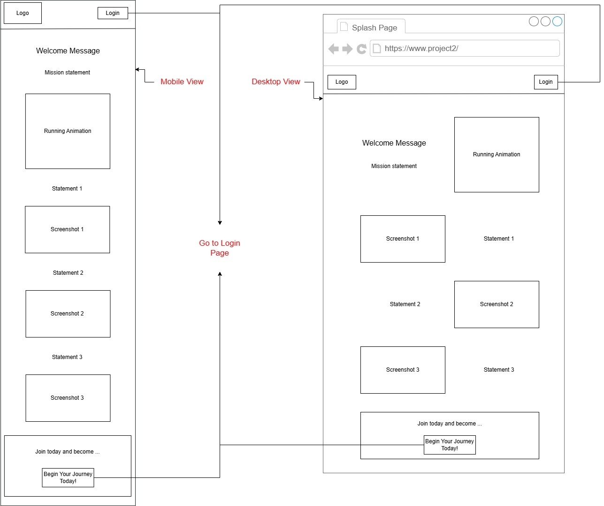
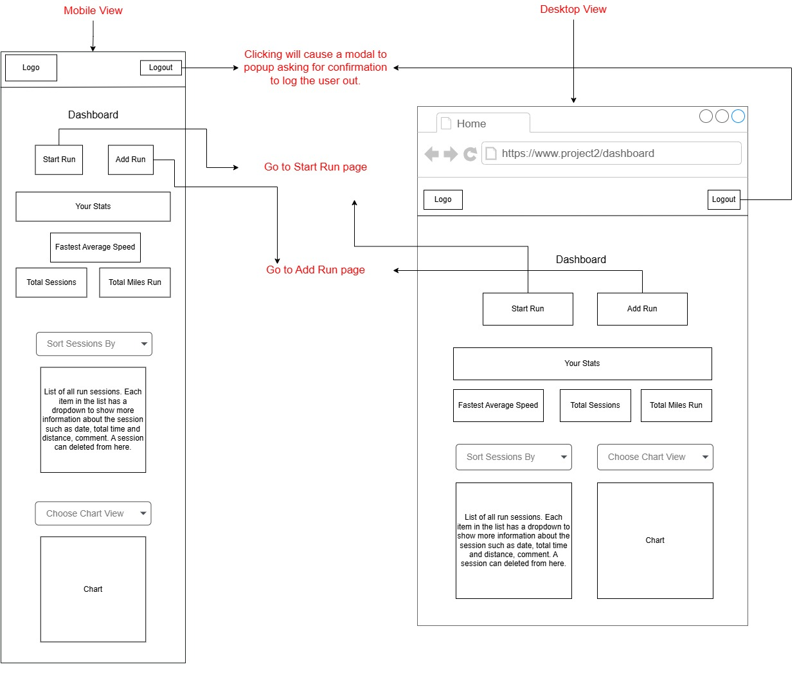
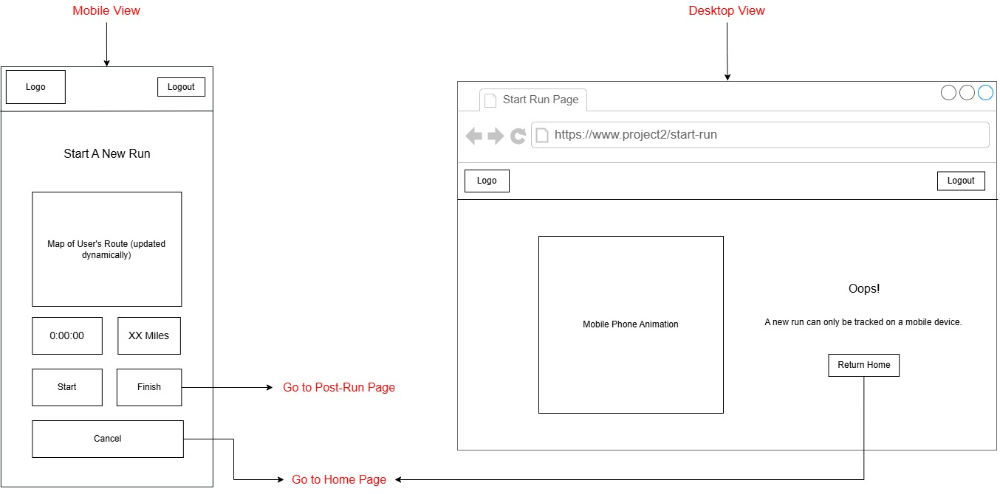
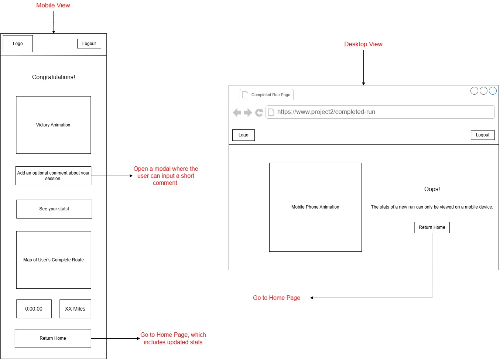
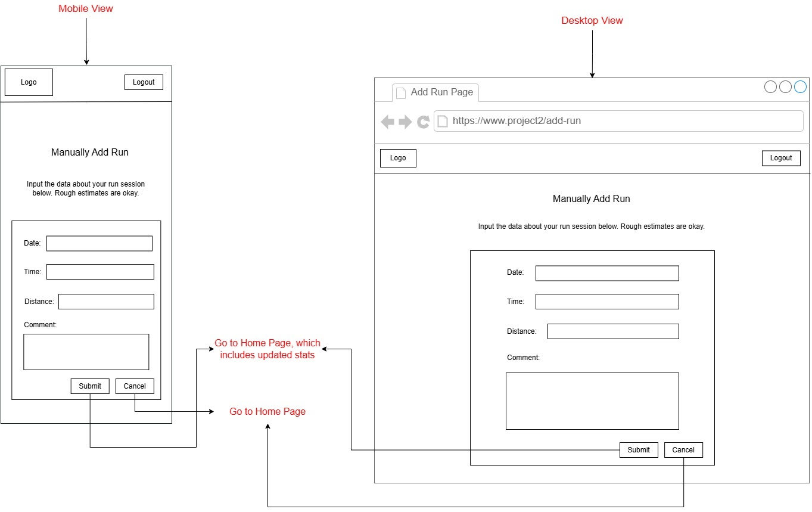
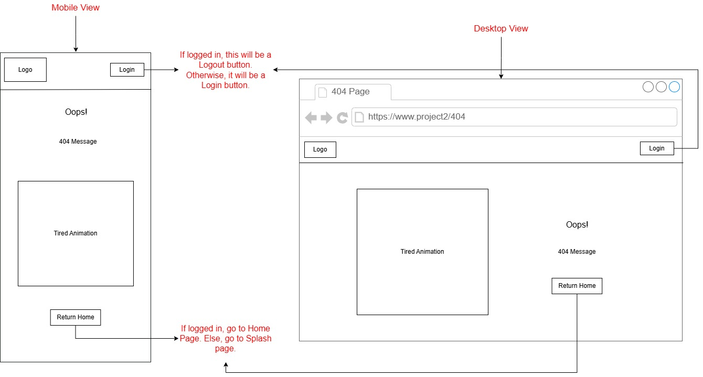

## Testing Notes

**Is there anything special we need to know in order to effectively test your app? (optional):**

- Run the following commands:
  - `npm install`
  - `npm run dev`
- Firebase rules are found in firestore.rules

## Screenshots of Site

Splash Page: Displayed to logged-out users to introduce TraceRoute and demonstrate the app's purpose and core functionality before authentication.

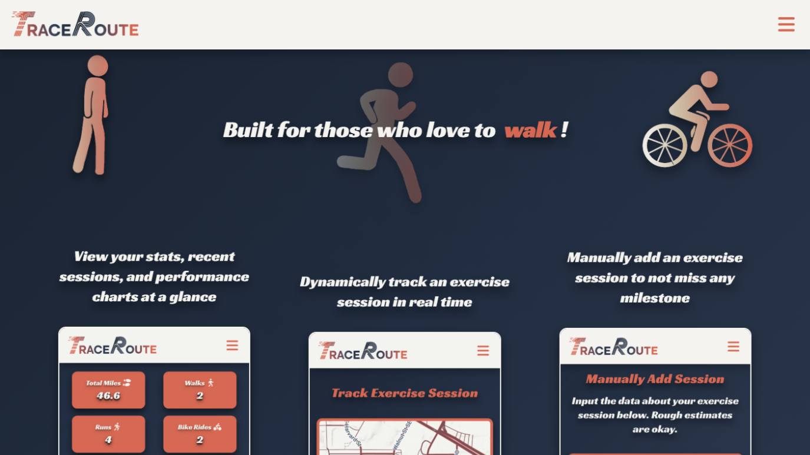
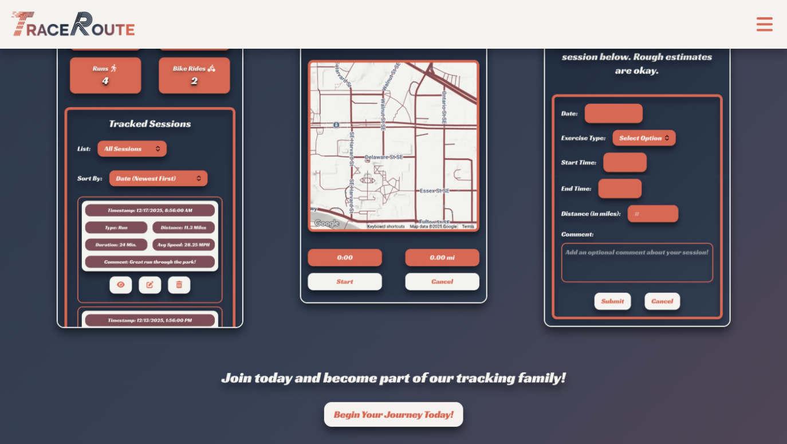

Dashboard Page: Logged-in users can view their exercise statistics, recent sessions, and performance charts at a glance.

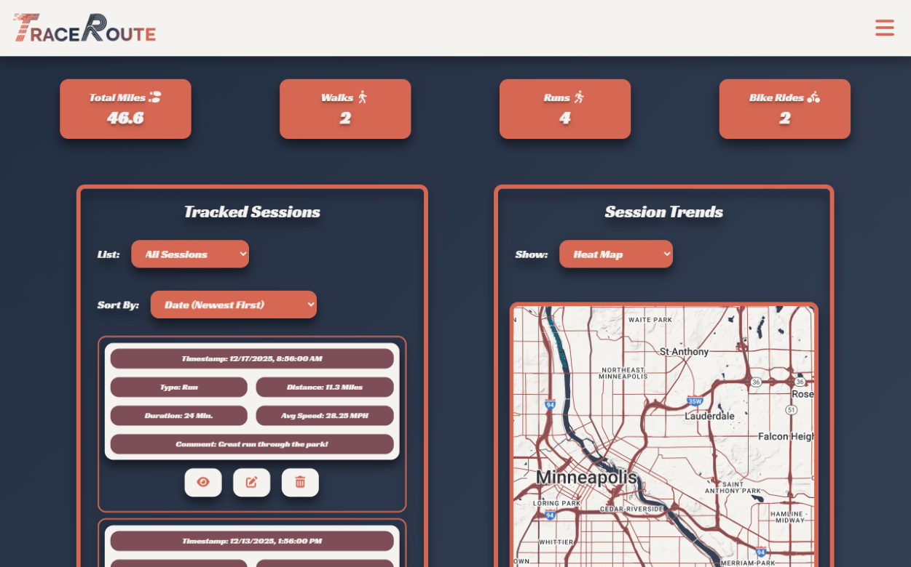

  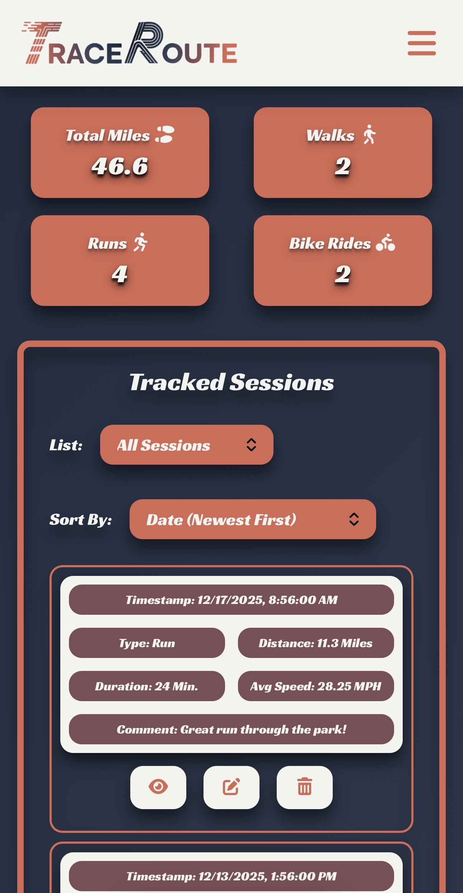

  

Start Session Page: Uses device geolocation to track an exercise session in real time and plot the route on the map.

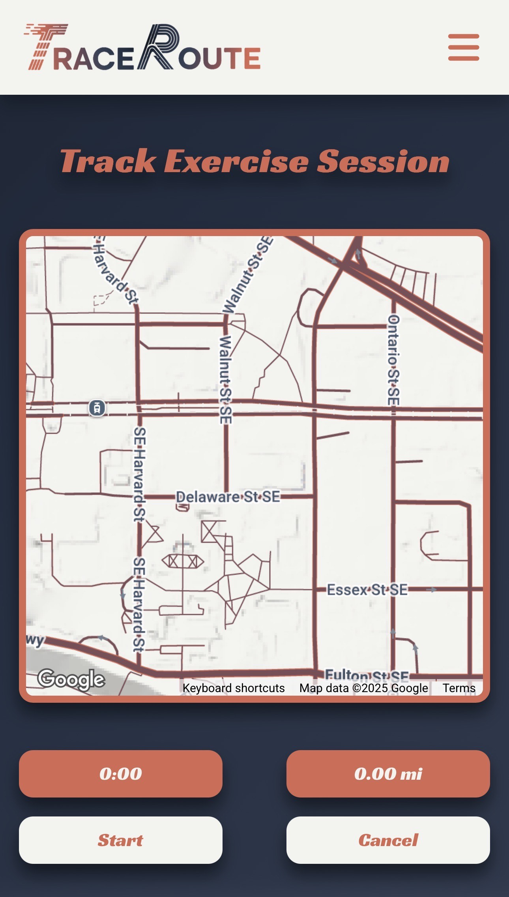

Add Session Page: Allows users to manually add an exercise session by entering the session's details.

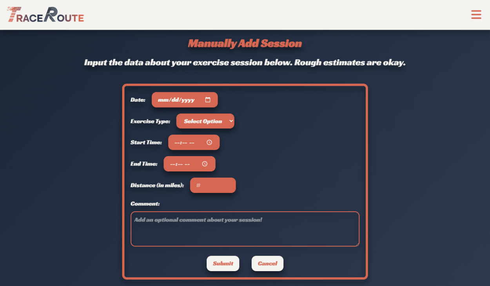

Error / Not Found Pages: Displayed when a user navigates to a forbidden or non-existent route, including mobile-specific handling.

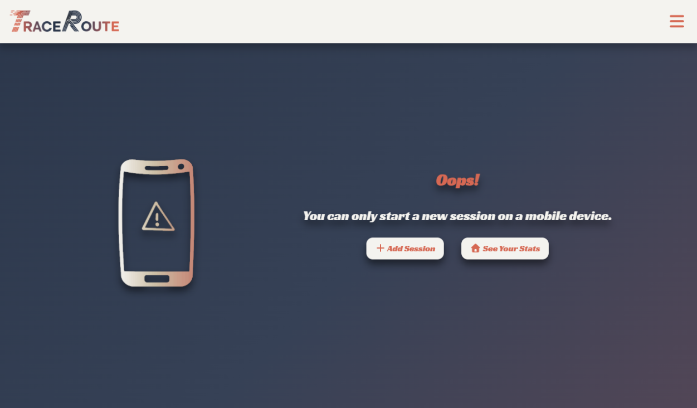
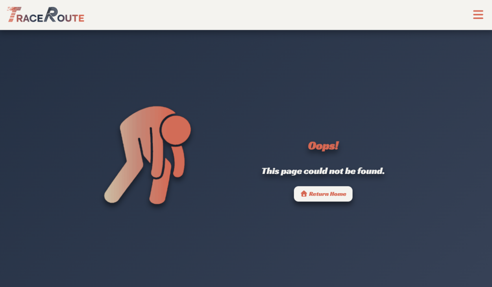

## External Dependencies

**Document integrations with 3rd Party code or services here. Please do not document required libraries (e.g., VUE, Firebase, vuefire).**

- Font Awesome: Provides icons used throughout the UI for actions, navigation, and visual clarity.
- Tailwind CSS: Utility-first CSS framework used to implement responsive layouts and consistent styling.
- Motion (motion-v): Adds animations and transitions to improve user experience and visual feedback.
- Chart.js: Renders interactive charts on the dashboard to visualize performance data.
- Google Maps API: Displays maps, plots routes, and generates heatmaps based on geolocation data.
- Simplify.js: Optimize polylines by taking away geopoints within a specified tolerance

**If there's anything else you would like to disclose about how your project relied on external code, expertise, or anything else, please disclose that here:**

N/A
